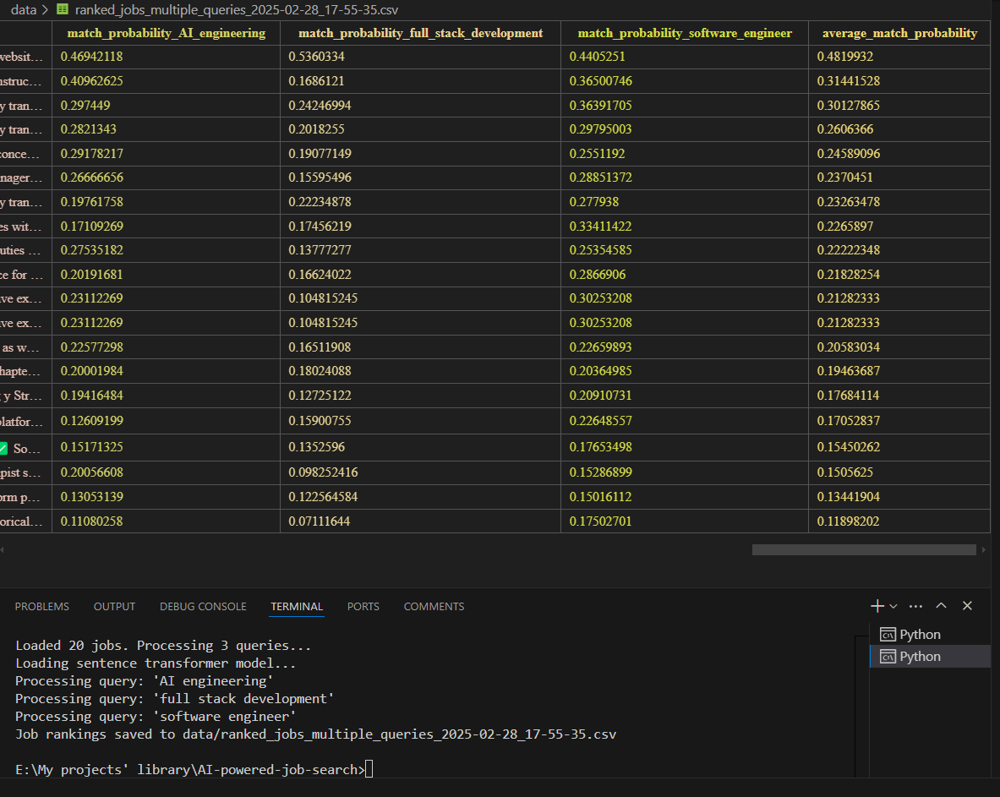

# AI-powered-job-search
This project allows scraping job applications from erasmusintern.org (or any job searching platform) and ranking them based on relevance to your queries.

# Job Search Tool for Erasmus Internships

A tool to scrape and rank internship opportunities from the Erasmus Intern website.

## Features

- **Scraper**: Collect job listings from Erasmus Intern website
- **AI-Powered Job Ranking**: Rank all jobs by their relevance to your specific queries
- **Enhanced Matching**: Use GROQ API for improved semantic matching and sentiment analysis
- **Multi-query Support**: Combine multiple job criteria in your search

## Installation

1. Clone this repository
2. Install required packages:
   ```
   pip install -r requirements.txt
   ```
3. Create a `.env` file with your configuration:
   ```
   BASE_URL=https://erasmusintern.org/traineeships
   MAX_PAGES=0  # Set to 0 for all pages
   DATA_DIR=data
   GROQ_API_KEY=your_groq_api_key  # Optional, for enhanced matching
   ```

## Usage

### Scrape Job Listings

```bash
python main.py scrape [--max-pages MAX_PAGES] [--no-details] [--output OUTPUT]
```

Options:
- `--max-pages`: Maximum number of pages to scrape (default: 0, means all pages)
- `--no-details`: Skip fetching detailed information for each job
- `--output`: Custom output filename

### Rank Jobs by Relevance

#### Basic Job Ranking

Use the `rank_jobs.py` script to rank all jobs by their relevance to your search query:

```bash
python rank_jobs.py "your search query" [--file DATA_FILE] [--output OUTPUT_FILE] [--model MODEL_NAME]
```

You can also search for multiple job types at once:

```bash
python rank_jobs.py "AI engineering" "full stack development" "marketing" [--file DATA_FILE]
```

Options:
- `--file`: Path to job data file (JSON or CSV)
- `--output`: Custom output filename
- `--model`: Name of the sentence transformer model to use (default: all-MiniLM-L6-v2)

#### Enhanced Job Ranking with GROQ API

For more accurate matching, sentiment analysis, and domain knowledge:

```bash
python rank_jobs_groq.py "your search query" [--file DATA_FILE] [--output OUTPUT_FILE] [--max-jobs MAX_JOBS]
```

Multiple queries are also supported:

```bash
python rank_jobs_groq.py "AI engineering" "machine learning" [--file DATA_FILE]
```

Options:
- `--file`: Path to job data file (JSON or CSV)
- `--output`: Custom output filename
- `--max-jobs`: Maximum number of jobs to process (useful for testing)

## Examples

### Example Commands

```bash
# Scrape jobs
python main.py scrape --max-pages 3

# Rank all jobs by relevance to data science
python rank_jobs.py "data science" --file data/erasmusintern_traineeships_2025-02-27_18-28-26.json

# Rank jobs with multiple criteria
python rank_jobs.py "machine learning" "python" "remote"

# Rank jobs with input file
python rank_jobs.py "AI engineering" "full stack development" "software engineer" --file data/data.json

# Enhanced ranking with sentiment analysis via GROQ API
python rank_jobs_groq.py "AI engineering" --max-jobs 50
```

## Understanding the Output

The ranked job outputs contain:

- All original job data (title, company, location, etc.)
- Match probability scores for each query (0-1 scale)
- For multiple queries, an average match probability
- When using GROQ API: sentiment analysis and domain relevance

Jobs are sorted by match probability with the best matches at the top.

## How It Works

### Basic Job Ranking Mechanism

1. **Loading Data**: The tool loads job listings from JSON or CSV files
2. **Text Representation**: Each job is converted to a text representation combining title, company, field, and description
3. **Embedding Generation**: Using sentence-transformers, both jobs and queries are converted to high-dimensional vector embeddings
4. **Similarity Calculation**: Cosine similarity is calculated between the query embedding and each job embedding
5. **Ranking**: Jobs are ranked by their similarity scores (0-1 scale) and saved to CSV with all original data plus match probabilities

### Enhanced GROQ API Mechanism

1. **Data Preparation**: Similar to basic ranking, but job analysis is performed by the GROQ LLM API
2. **Semantic Analysis**: The GROQ API (using Llama 3 70B) analyzes each job with deeper understanding of:
   - Domain knowledge (recognizing that "ML Engineer" is relevant to an "AI" query)
   - Contextual understanding (grasping job requirements beyond keywords)
   - Skill matching (identifying relevant skills even when described differently)
3. **Sentiment Analysis**: Jobs are analyzed for tone and cultural fit
4. **Explanation Generation**: The API provides rationale for why each job matches
5. **Batch Processing**: Jobs are processed in batches to optimize API usage

This deep semantic approach provides more accurate matching than pure embedding-based methods, especially for technical roles where understanding domain relationships is critical.
## Output
